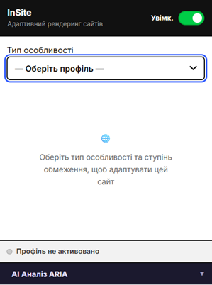
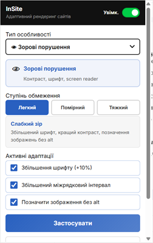
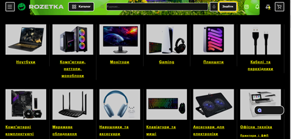
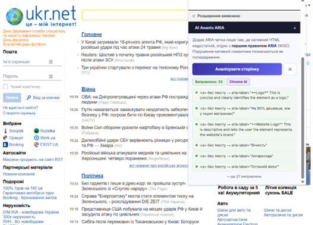

# 📘 InSite

> Chrome-розширення для адаптивного рендерингу веб-сторінок з профілями доступності.

---

## 👤 Автор

- **ПІБ**: Луговська Вероніка
- **Група**: ФЕІМ-12
- **Керівник**: Ляшкевич Василь, доцент кафедри системного проектування
- **Дата виконання**: [25.05.2026]

---

## 📌 Загальна інформація

- **Тип проєкту**: Розширення Chrome / веб-розширення
- **Мова програмування**: JavaScript
- **Фреймворки / Бібліотеки**: React, Vite, @crxjs/vite-plugin, MUI
- **Manifest**: Chrome Manifest V3

---

## 🧠 Опис функціоналу

- 🔧 Вибір профілів доступності: зорові, слухові, моторні, когнітивні
- 🎛️ Налаштування рівня доступності та додаткових опцій для кожного профілю
- 🌐 Застосування CSS/DOM змін безпосередньо до активної веб-сторінки
- 🧠 ARIA-аналізатор сторінки для покращення доступності та додавання aria-label
- 💾 Збереження вибраного профілю й стану в `chrome.storage.local`
- 🧩 Наявність popup-інтерфейсу, options page, side panel та content script

---

## 🧱 Опис основних класів / файлів

| Клас / Файл                         | Призначення                                                   |
| ----------------------------------- | ------------------------------------------------------------- |
| `src/manifest.js`                   | Головний опис розширення та налаштування Manifest V3          |
| `src/popup/Popup.jsx`               | Основний інтерфейс користувача для вибору профілю доступності |
| `src/contentScript/index.js`        | Контент-скрипт, який застосовує адаптивні зміни на сторінці   |
| `src/config/profilesData.js`        | Дані профілів, рівнів і доступних налаштувань                 |
| `src/contentScript/ariaAnalyzer.js` | Логіка ARIA-аналізу і підвищення семантики сторінки           |
| `src/contentScript/profiles/*.js`   | Реалізації CSS і DOM-фіксів для кожного профілю               |
| `src/background/index.js`           | Фоновий service worker для розширення                         |
---

## ▶️ Як запустити проєкт "з нуля"

### 1. Встановлення інструментів

- Node.js v14 або вище
- npm (поставляється з Node.js)

### 2. Клонування репозиторію

```bash
git clone https://github.com/your-user/project-name.git
cd project-name
```

### 3. Встановлення залежностей

```bash
npm install
```

### 4. Запуск в режимі розробки

```bash
npm run dev
```

Це запустить Vite, після чого можна переглядати сторінки розширення за URL:

- `http://localhost:3000/popup.html`
- `http://localhost:3000/options.html`
- `http://localhost:3000/sidepanel.html`

### 5. Збірка та встановлення

```bash
npm run build
```

Після цього у папці `build/` з’явиться готовий пакет для завантаження в Chrome як unpacked extension.

---

## 🔌 Як працює розширення

### Основна логіка

- `popup` відправляє повідомлення content script для застосування або скидання профілю
- `contentScript` обробляє `APPLY_PROFILE`, `RESET`, `ANALYZE_ARIA` і `RESET_ARIA`
- `chrome.storage.local` зберігає обраний профіль, рівень і стан чекбоксів
- при перезавантаженні сторінки останній активний профіль автоматично відновлюється

### Повідомлення між компонентами

- `APPLY_PROFILE` — застосувати адаптивні стилі/DOM-зміни
- `RESET` — скинути всі зміни
- `ANALYZE_ARIA` — виконати аналіз і додати ARIA-атрибути
- `RESET_ARIA` — видалити ARIA-виправлення з сторінки

---

## 🖱️ Інструкція для користувача

1. **Відкрийте розширення** — натисніть на іконку InSite у Chrome.
2. **Увімкніть розширення** — перемикач вгорі сторінки popup.
3. **Оберіть профіль** — зорові, слухові, моторні або когнітивні потреби.
4. **Виберіть рівень** — слабкий, помірний або високий рівень адаптації.
5. **Налаштуйте чекбокси** — додаткові опції змінюються в залежності від профілю.
6. **Натисніть "Застосувати"** — зміни відобразяться на активній вкладці.
7. **Скинути** — кнопка повертає сторінку до початкового стану.

---

## 📷 Приклади / скриншоти

- Popup з вибором профілю


- Сторінка з підвищеним контрастом

- Результати ARIA-аналізу

---

## 🧪 Проблеми і рішення

| Проблема                           | Рішення                                                                              |
| ---------------------------------- | ------------------------------------------------------------------------------------ |
| Розширення не застосовує настройки | Переконайтесь, що активна вкладка дозволяє content script, і перезавантажте сторінку |
| popup не зберігає стан             | Перевірте `chrome.storage.local` та дозвіл `storage` у manifest                      |
| ARIA-аналіз не працює              | Перезавантажте вкладку, перевірте помилки у консолі DevTools                         |
| Не працює після `npm run dev`      | Запустіть `npm run build` і завантажте папку `build/` як unpacked extension          |

---

## 🧾 Використані джерела / література

- Документація Chrome Extensions Manifest V3
- React офіційна документація
- Vite документація
- W3C Web Accessibility Guidelines (WCAG)
- Статті з ARIA та доступності веб-контенту
